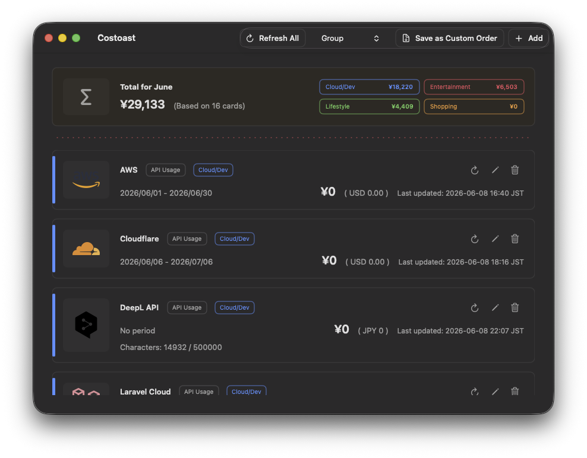

# Costoast

Your costs, served fresh.

Costoast is a tiny macOS dashboard for checking active web service costs at a glance.

Current implementation:

- macOS SwiftUI dashboard with card and compact list views.
- Local card settings, display order, and credentials storage support.
- API usage, subscription plan, and manual amount card sources.
- JPY conversion, monthly total summary, service groups, and basic sorting.

This repository is currently adding service billing providers on top of the card dashboard, total cost, and JPY conversion base.

Implemented:

- Add, edit, delete, and reorder billing cards.
- Store non-sensitive billing card settings locally.
- Restore cards and display order after app restart.
- Show Manual Amount and Subscription Plan billing values.
- Add fixed-price subscription services as manually managed Subscription Plan cards.
- Fetch OpenAI API, AWS Cost Explorer, GCP Billing Export, Azure Cost Management, and Cloudflare subscription billing data from separated providers.
- Store API keys and secrets in macOS Keychain.
- Use the fixed AWS Cost Explorer endpoint in `us-east-1`.
- Convert each card's original amount to an estimated JPY amount.
- Show a Total card with the estimated JPY total.
- Keep the Summary Card fixed above the scrollable card list, separated from billing cards by a subtle pink dotted separator.
- Switch between Cards View and Compact View for the billing card list.
- Sort billing cards by Custom Order, Name, Service Group, Amount High to Low, or Amount Low to High.
- Pin important cards above the scrollable card list in Cards View.
- Auto refresh API-backed cards on a selectable interval.
- Rearrange cards with up and down controls on each card.
- Save the current sorted order as the new Custom Order with `Save as Custom Order`.
- Fetch FX rates from an external no-key exchange rate API.

Provider notes:

- Fixed-price subscription services are managed as Subscription Plan cards, not API integrations. Supported presets include OpenAI ChatGPT, OpenAI Codex, GitHub Copilot, DeepL, Adobe Creative Cloud, Dropbox, YouTube Premium, Netflix, Disney+, Apple TV+, Apple Music, Apple Arcade, iTunes Match, Hulu, Amazon Prime, niconico Premium, ABEMA, d Anime Store, DMM TV, U-NEXT, DAZN, Spotify Premium, Nintendo Switch Online, PlayStation Plus, Xbox Game Pass, Kindle Unlimited, Audible, Apple One, Apple Fitness+, iCloud+, Google One, Microsoft 365, 1Password, and pixiv.
- Services are grouped as Cloud/Dev, Entertainment, Lifestyle, Shopping, and Manual in the picker and total summary.
- The Summary Card is not part of sorting or manual rearranging. Add Card remains at the end of the scrollable billing card list.
- Compact View shows each card as one line with logo, name, JPY amount, and original amount only. Sorting still applies, but editing actions and manual rearranging are available only in Cards View.
- Up and down controls save the resulting visible order as the new Custom Order.
- Subscription plan amounts are editable because prices may vary by region, billing method, campaign, and future price changes. Presets are input helpers only and do not guarantee the latest prices.
- Bundle services such as Apple One, Apple Music, Apple Arcade, Apple Fitness+, iCloud+, Hulu Disney+ Set, and Google One AI plans can overlap with other cards, so check for double counting when adding cards.
- GCP uses Cloud Billing Export to BigQuery. Configure Project ID, Dataset ID, Table Name, and optionally Billing Account ID. The Service Account JSON is stored in macOS Keychain.
- Azure uses Tenant ID, Client ID, and either Scope or Subscription ID with Azure Cost Management Query API. The Client Secret is stored in macOS Keychain.
- Cloudflare uses Account ID and API Token. The API Token is stored in macOS Keychain. Cloudflare billing APIs and subscription data can be unavailable depending on account type and token permissions.
- Laravel Cloud uses its usage API with an API token stored in macOS Keychain.
- OpenAI Codex separates ChatGPT-plan Codex subscriptions from API Usage costs. The API Usage provider reads OpenAI organization costs and only reports costs that match the configured Codex filters.
- DeepL API uses the `/v2/usage` endpoint to fetch character usage and billing-period data. Cost is estimated only from user-entered pricing settings, and cards without enough pricing data are excluded from Total.
- JPY values are estimates based on the latest fetched billing amounts and current FX rates. They are not finalized invoice amounts.

Not implemented yet:

- Charts, notifications, or menu bar residency.
- Detailed UI/UX adjustments for the dashboard.

Credentials such as OpenAI API keys, AWS secret access keys, GCP Service Account JSON, Azure client secrets, Cloudflare API tokens, Laravel Cloud API tokens, and DeepL API keys are not stored in UserDefaults or JSON card settings.

Credential storage notes:

- Secrets are stored as generic password items in macOS Keychain with `kSecAttrAccessibleWhenUnlockedThisDeviceOnly`.
- Refresh and Auto Refresh read credentials without `kSecUseOperationPrompt` or biometric/user-presence access control.
- Credentials loaded during the current app session are cached in memory to reduce repeated Keychain reads during Refresh and Auto Refresh.
- Editing a card loads credentials through a display-specific path so future UI-only authentication policy can be separated from background refresh behavior.
